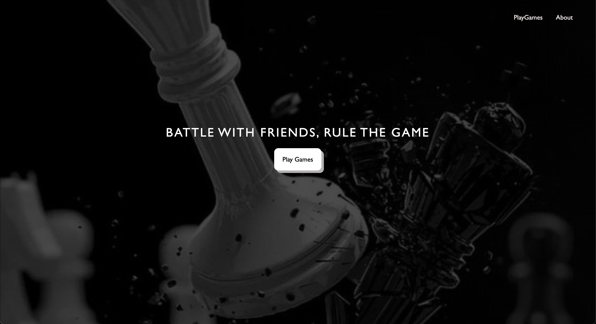
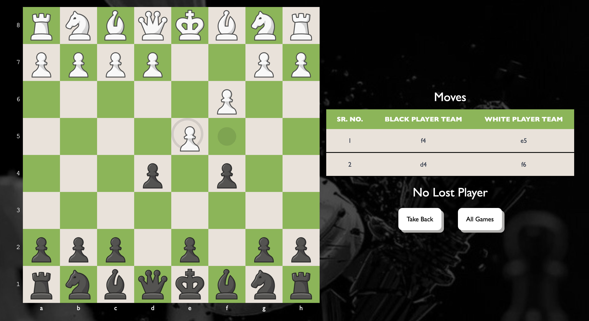

# PlayArena - Multiplayer Gaming Platform 🎮

**PlayArena** is a multiplayer gaming platform where users can come together to play different games. Currently, it features a multiplayer chess game, leveraging Socket.IO for real-time communication. Our goal is to add more games and grow the platform into a comprehensive multiplayer hub.

## Features 🕹️

- **Multiplayer Chess**: Play chess with friends or other players in real-time.
- **Real-time Communication**: Socket.IO ensures seamless gameplay.
- **User-Friendly Interface**: A clean and easy-to-use interface for an immersive gaming experience.
- **Responsive Design**: Play on any device, from desktops to mobiles.

## Screenshots 📸


_A screenshot of the PlayArena home page._


_Real-time multiplayer chess game in action._

## Tech Stack 🛠️

- **Frontend**: React.js
- **Backend**: Node.js, Express.js
- **Websockets**: Socket.IO for real-time communication
- **Hosting**: Vercel (Frontend) and Rendered (Backend)
  
## Installation ⚙️

To run this project locally, follow these steps:

### Prerequisites:
- Node.js (v14+)
- NPM 

### Steps:

1. Clone the repository:
    ```bash
    git clone https://github.com/CodeHawkCraft/PlayArena.git
    cd PlayArena
    ```

2. Navigate to the Frontend directory and install dependencies:
    ```bash
    cd PlayArena-Frontend
    npm install
    ```

3. Navigate to the Backend directory and install dependencies:
    ```bash
    cd ../PlayArena-Backend
    npm install
    ```

4. Create a `.env` file in the **Backend** directory and set the `PORT` to `4000`:

    ```bash
    cd PlayArena-Backend
    touch .env
    echo "PORT=4000" >> .env
    ```

5. Start both the frontend and backend:

    - In the **Frontend**:
      ```bash
      cd ../PlayArena-Frontend
      npm start
      ```

    - In the **Backend**:
      ```bash
      cd ../PlayArena-Backend
      npm start
      ```

6. The application should now be running:
    - **Frontend**: `http://localhost:3000`
    - **Backend**: `http://localhost:4000`

## Usage/Examples 🚀

**Start a new game**:

- Go to the homepage.

- Click on the **"Play Games"** button.

- Choose your favorite game from the list (currently, only Chess is available).

- Select **"Play Online"** to start a game with your friend.

- Enter your name.

- Copy the game link and share it with your friend.

- Ask them to open the link and enter their unique name.

- Once they do, the game will start automatically.

## ⭐ Support Us

If you enjoy using PlayArena and would like to support the project, please consider starring the repository on GitHub! Your support helps us grow and improve the platform for everyone.
